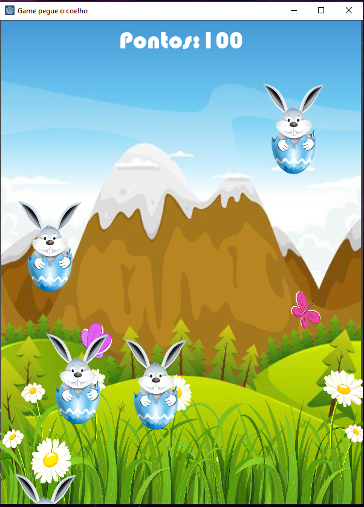
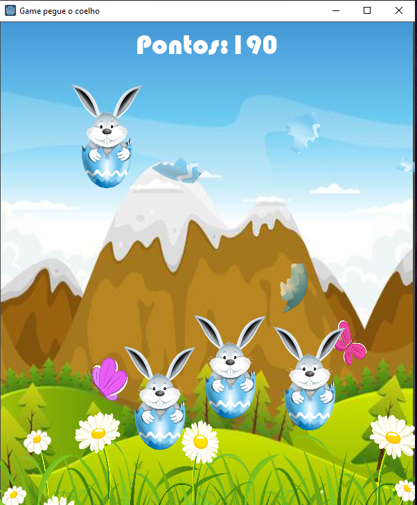

# godot-rabbit_game
##Description
I developed this game with the help of an online course I took on the udemy platform, where I could learn more about the gdscript programming language
This game contains score, the rabbits appeared on the screen randomly, you will click with the mouse on the rabbits, then an explosion animation with visual effect and sound effect will appear,

##Screenshots
| Image 1 | Image 2 |
|----------|----------|
|  | |
